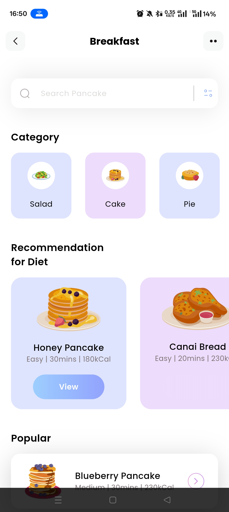
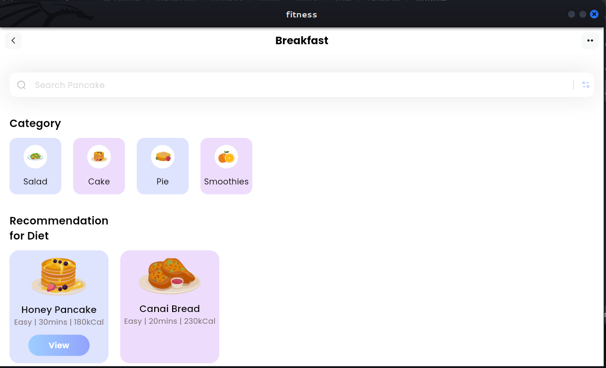

# Simple Flutter Fitness App

A clean, modern Flutter application for tracking breakfast and diet plans.

## App Screenshots



## Features

- Smart Search: Search for specific food items like "Pancake"
- Category Browsing: Browse food categories (Salad, Cake, Pie, etc.)
- Diet Recommendations: Get personalized diet recommendations
- Popular Diets: View trending diet plans with difficulty levels
- Beautiful UI: Modern design with smooth animations and SVG icons
- Responsive Layout: Works on both mobile and tablet devices

## Project Architecture

### Main Components
- HomePage: Main dashboard with all features
- CategoryModel: Data model for food categories
- DietModel: Data model for diet recommendations  
- PopularModel: Data model for popular diets

### Key Widgets
- `_searchField()`: Custom search bar with filter functionality
- `_categoriesSection()`: Horizontal scrollable category list
- `_recommendationSection()`: Diet recommendation cards
- `_popularSection()`: List of popular diets with selection states

## Getting Started

### Prerequisites
- Flutter SDK 3.0.0 or higher
- Dart 2.17.0 or higher

### Installation

1. Clone the repository
   ```bash
   git clone https://github.com/sonoou/simple_flutter_app.git
   cd simple_flutter_app
   ```

2. Install dependencies
   ```bash
   flutter pub get
   ```

3. Run the application
   ```bash
   flutter run
   ```

## Project Structure

```
simple_flutter_app/
├── lib/
│   ├── main.dart
│   ├── pages/
│   │   └── home.dart
│   └── models/
│       ├── DietModel.dart
│       ├── PopularModel.dart
│       └── category_model.dart
├── assets/
│   ├── icons/
│   └── images/
├── screenshots/
├── pubspec.yaml
└── README.md
```

## Dependencies

```yaml
dependencies:
  flutter:
    sdk: flutter
  flutter_svg: ^2.0.9
```

## Contributing

1. Fork the repository
2. Create a feature branch
3. Commit your changes
4. Push to the branch
5. Open a Pull Request

## License

This project is licensed under the MIT License.

## Author

**Sonu**
- GitHub: [@sonoou](https://github.com/sonoou)